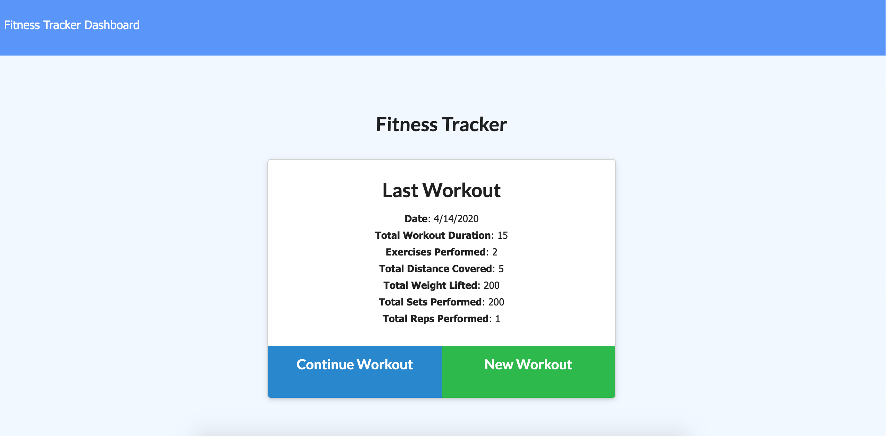
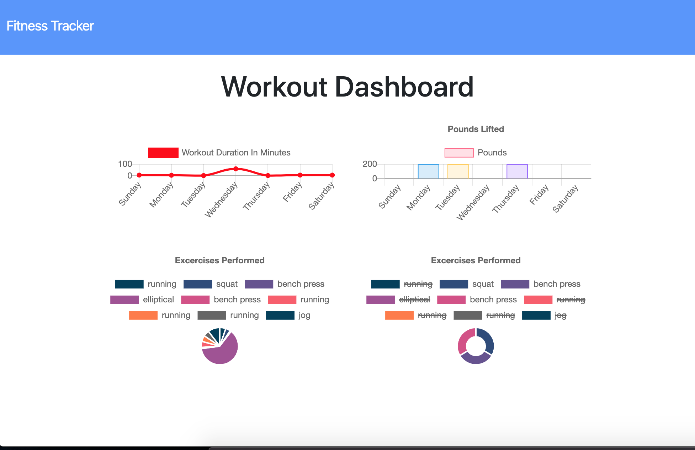

# workout-tracker

This is a simple app designed to track a users' workouts. The user's most recent workout will be displayed on the home page. The user then has the option of continuing that workout or beginning a new one. Each workout is stored in a mongo database as a document in a collection of workouts. When the user begins a new workout, a blank schema/model is added server side to the database. A unique id is given to this empty workout, and the date is added to the object. Then when the user adds exercises to the workout, the workout is found in the database using Workout.find({}) by id in server.js, and then the array is modified to include the new exercises, and the workout is modified to include the new array. When the dashboard button is clicked in the navigation bar, the app displays the exercise stats for the week. This includes total weight lifted and duration by day. If the user is using the app from localhost, the data will be stored in local database. Otherwise, from Heroku app, data is stored in remote mongo database using mlab add on.

 
 

### Technologies used
Express  
Node  
Mongoose (models/schemas) 
Mongo database  
Robo 3T (to establish connection to database)  

### How to start app from terminal
Type 'mongod' in terminal  
Open Robo 3T, create new connection  
Type 'npm install' command in terminal  
Type 'node seeders/seed' if you would like to seed the database  
Type 'node server' or 'npm start' to run app locally on localhost:3000  
Use the app!  

### Link to Heroku app

<a href="https://gentle-coast-21252.herokuapp.com/">https://gentle-coast-21252.herokuapp.com/</a>

 
 

